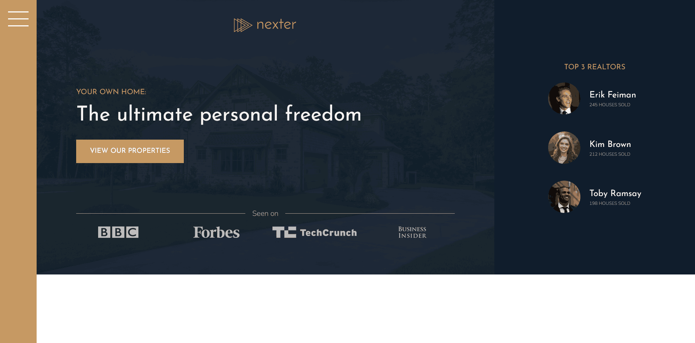

# Nexter - Your home, your dream

This website was built during my learning of advanced CSS responsive design  in the year 2024 from Udemy by Jonas. Felt amazing to learn the concept of CSS with lots of modern techniques. 

## Table of contents

- [Nexter - Your home, your dream](#nexter---your-home-your-dream)
  - [Table of contents](#table-of-contents)
  - [Overview](#overview)
    - [Screenshot](#screenshot)
    - [Links](#links)
  - [My process](#my-process)
    - [Built with](#built-with)
  - [Author](#author)

## Overview

### Screenshot

### Links

- Solution URL: [*VIEW CODE*](https://github.com/Phurba-Sherpa/nexter)
- Live Site URL: [*PREVIEW SITE*](https://nexter.phurbasherpa.name.np/)

## My process

### Built with

- Semantic HTML5 markup
- CSS custom properties
- Flexbox
- grid
- Keyframes
- SASS

## Author

- Website - [Phurba Sherpa](https://v2.phurbasherpa.name.np)
- Medium - [@phurba](https://medium.com/@phurba)